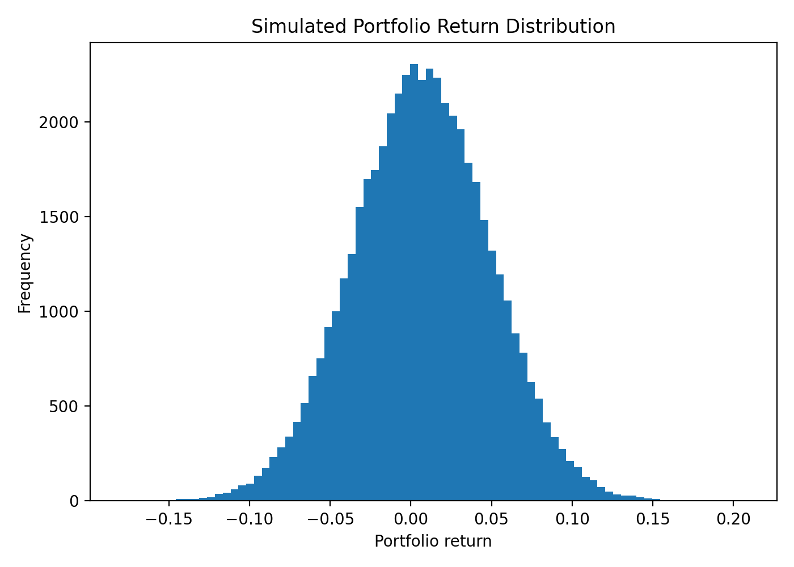
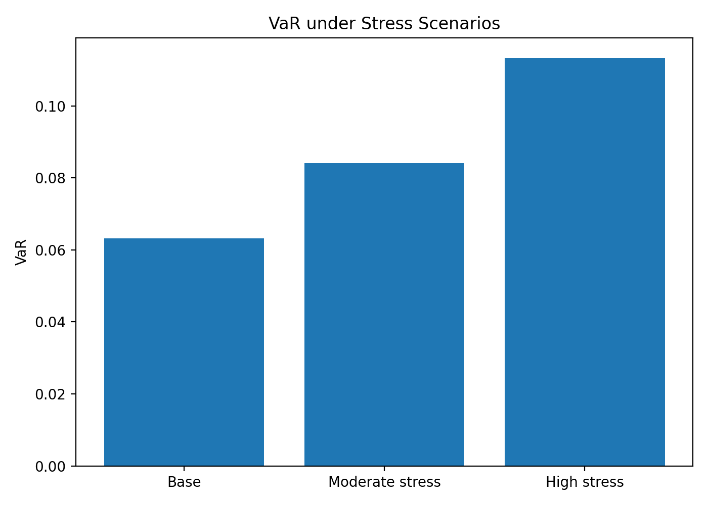

# Monte Carlo Risk Simulation for Portfolio Loss Estimation

## Overview
This project implements a Monte Carlo simulation framework for estimating portfolio risk under uncertainty. It demonstrates practical skills in probabilistic modeling, scenario generation, risk estimation, and visualization.

## Motivation
Risk analysis often requires understanding tail behavior under uncertain market conditions. This project simulates correlated asset returns and evaluates portfolio loss metrics using repeated random sampling.

## Methods
- Monte Carlo simulation of correlated asset returns
- Portfolio aggregation
- Value at Risk (VaR)
- Conditional Value at Risk (CVaR)
- Stress scenario analysis

## Outputs
- Simulated return distribution
- Loss distribution
- VaR and CVaR summary table
- Stress scenario comparison plot

## Repository Structure
- `main.py`: runs the full workflow
- `src/simulate.py`: return simulation and stress scenarios
- `src/risk_metrics.py`: VaR and CVaR calculations
- `src/plotting.py`: plots
- `results/`: saved outputs

## Skills Demonstrated
- Python
- Monte Carlo simulation
- Probabilistic modeling
- Numerical analysis
- Risk metrics
- Data visualization

## Future Improvements
- Historical simulation
- Option portfolio extension
- Factor-based scenarios

- ## Example Output

### Return Distribution

### Loss Distribution with VaR

### Stress Scenario Comparison

- Volatility clustering models
